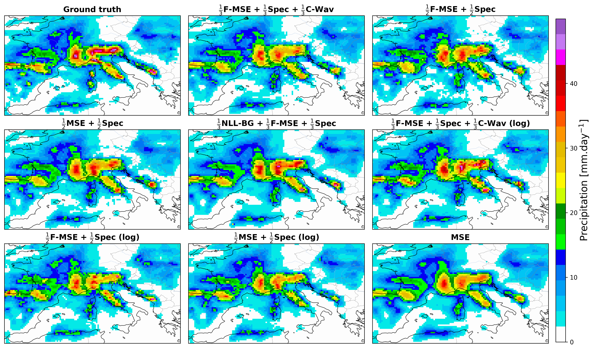

# Training loss benchmarking for statistical downscaling

Benchmarking training losses for deep learning-based statistical downscaling.

[](https://zenodo.org/doi/10.5281/zenodo.17185802)

## Overview

This repository provides source code from our paper **Training loss matters: exploring new fit-for-purpose loss combinations for statistical downscaling**. The code includes a general framework for implementing and benchmarking various loss functions for two variables: 10m wind speed and precipitation and can be extended to other variables.



We evaluate a wide range of standard and novel loss functions — including combinations — across two representative downscaling tasks:

* **Precipitation (`pr`)**
* **10m zonal wind (`uas`)**

The code is built on **PyTorch Lightning** with a **Vision Transformer (ViT)** model, and includes modules for training, evaluation, and reproducible experiment configurations.

## Repository structure

```
.
├── configs/
│   ├── exp_config_pr.yaml
│   ├── exp_config_uas.yaml
│   ├── losses_pr.yaml
│   ├── losses_uas.yaml
├── data/
│   ├── data_module.py
│   └── dataset.py
├── evaluation/
│   ├── compare_pr.yaml
│   ├── compare_uas.yaml
│   ├── evaluator.py    
│   ├── evaluate_pr.py
│   ├── evaluate_uas.py
│   ├── evaluate_pr_utils.py
│   └── evaluate_uas_utils.py
├── models/
│   ├── losses.py
│   ├── patch_embedding.py
│   ├── time_encoder.py
│   └── vision_transformer.py
├── training/
│   ├── callbacks.py
│   ├── lightning_module.py
│   ├── train.py
│   └── utils.py
├── requirements.txt
└── README.md
```

## Installation

```bash
git clone https://github.com/relmonta/downscaling_loss_benchmark.git
cd downscaling_loss_benchmark
pip install -r requirements.txt
```
## Configuration

Training and loss settings are specified in the following YAML files:
* `configs/exp_config_*.yaml` – experiment/training setup (* : `pr` or `uas`)
* `configs/losses_*.yaml` – list of losses and their parameters


Make sure to check the paths in the config files in `configs/exp_config_*.yaml` and modify them as needed.

## Evaluation

Set the comparison settings in `evaluation/compare_*.yaml`, then run the evaluation script.
Example (precipitation):

```bash
python -m evaluation.evaluate_pr
```

This generates a comparison of all models specified in `evaluation/compare_*.yaml`. Plots are saved in `data/plot_path` or as specified in the `configs/exp_config_*.yaml` file.

## Training

Experiments are configured via YAML files in `configs/`.
Example (precipitation with default settings):

```bash
python -m training.train -var_name 'pr'
```

Arguments:

* `-var_name` : variable name (`pr` or `uas`)
* `--criterion "<loss_name>"` : if specified, ignores loss in config and uses this loss instead
* `--resume` : resume from a checkpoint if available (only best model is stored)
